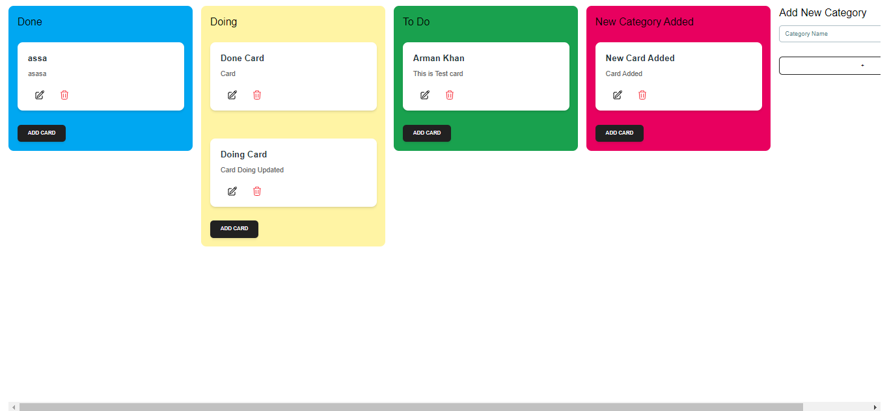
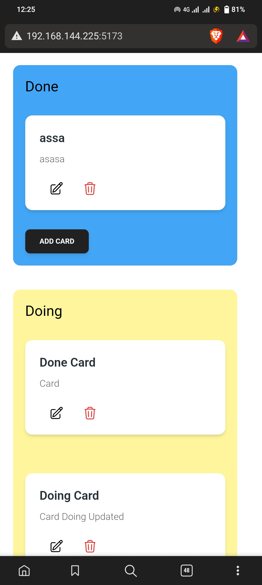

# Kanban Board Application

A Kanban board application built with Vite, MongoDB, and Node.js. This application allows users to manage tasks, move them between different status groups, and provides a responsive design for both desktop and mobile devices.




## Features

### Front-end Features:

1. **Homepage:** Displaying all tasks, segregated by their status groups: To Do, Doing, Done and custom.
2. **Task Card:** Showcasing the task title and description.
3. **Add Task:** Integrated a form to create a new task, prompting users for the title and description of the task.
4. **Edit Task:** Provided an option to edit an existing task’s title and description.
5. **Delete Task:** Implemented a feature to remove a task permanently.
6. **Task Status:** Empowered users to effortlessly drag and drop tasks between the To Do, Doing, Done and custom categories.
7. **Responsive Design:** The application is fully functional and visually coherent on mobile devices.

### Back-end Requirements:

1. Created an API with endpoints to support CRUD operations for tasks.
2. Tasks are stored in a database.

## Live Demo

Check out the live demo of the project [here](https://ark-kanban-board.vercel.app/).Test out the features, create, edit, and delete tasks, and experience the responsive design.

## Installation and Setup

1. Clone this repository.
1. Clone this repository:

   ```bash
   git clone https://github.com/Armaankhaan01/kanbanBoard-frontend

   ```

1. Navigate to the project directory.

```bash

  cd kanbanBoard-frontend
```

### Front-end (Vite):

```bash
npm install
npm run dev
```
